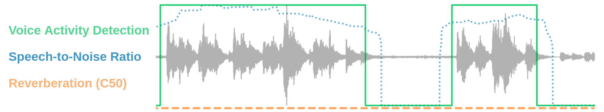

# Brouhaha: multi-task training for voice activity detection, speech-to-noise ratio, and C50 room acoustics estimation (2023)



Here's the companion repository of [*Brouhaha*](https://arxiv.org/abs/2210.13248). 
You'll find the instructions to install and run our pretrained model. Given an audio segment, Brouhaha extracts:
- speech/non-speech segments
- Speech-to-Noise Ratio (SNR) , that measures the speech level compared to the noise level
- C50, that measures to which extent the environment is reverberant

You can listen to some audio samples we generated to train the model [here](https://marvinlvn.github.io/projects/1_project/).

If you want to dig further, you'll also find the instructions to run the audio contamination pipeline, and retrain a model from scratch.

### Installation

```
# clone brouhaha
git clone https://github.com/marianne-m/brouhaha-vad.git
cd brouhaha-vad

# creating a conda environment
conda env create -n brouhaha python=3.8
conda activate brouhaha-vad

# install brouhaha
pip install .
```

Depending on the environment you're running the model in, it may be necessary to install libsndfile with the following command:
```
conda install -c conda-forge libsndfile
```

### Extract predictions

```
python main.py apply \
          --model_path models/best/checkpoints/best.ckpt \
          --apply_dir path/to/inferences
          --data_dir path/to/data \
          --ext "wav"
```

### Going further

1) [Run the audio contamination pipeline](https://github.com/marianne-m/brouhaha-maker)
2) [Train your own model](./doc/training.md)

### Citation

```bibtex
@article{lavechin2022brouhaha,
  Title   = {{Brouhaha: multi-task training for voice activity detection, speech-to-noise ratio, and C50 room acoustics estimation}},
  Author  = {Marvin Lavechin and Marianne Métais and Hadrien Titeux and Alodie Boissonnet and Jade Copet and Morgane Rivière and Elika Bergelson and Alejandrina Cristia and Emmanuel Dupoux and Hervé Bredin},
  Year    = {2022},
  Journal = {arXiv preprint arXiv: Arxiv-2210.13248}
}

@inproceedings{Bredin2020,
  Title = {{pyannote.audio: neural building blocks for speaker diarization}},
  Author = {{Bredin}, Herv{\'e} and {Yin}, Ruiqing and {Coria}, Juan Manuel and {Gelly}, Gregory and {Korshunov}, Pavel and {Lavechin}, Marvin and {Fustes}, Diego and {Titeux}, Hadrien and {Bouaziz}, Wassim and {Gill}, Marie-Philippe},
  Booktitle = {ICASSP 2020, IEEE International Conference on Acoustics, Speech, and Signal Processing},
  Address = {Barcelona, Spain},
  Month = {May},
  Year = {2020},
}
```
