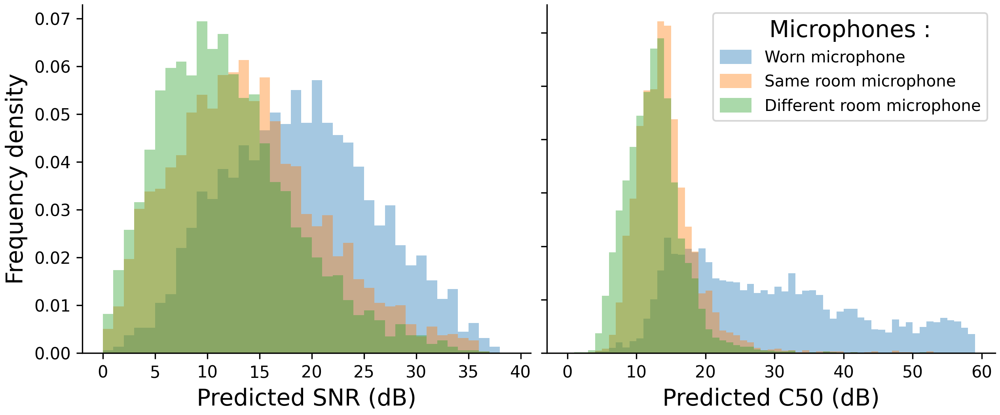

# Estimated SNR and C50 on CHiME5 dataset

## Objective

The aim of this study is to extract the C50 and SNR score, by applying the Brouhaha model on the 
[CHiME5](https://spandh.dcs.shef.ac.uk/chime_challenge/CHiME5/data.html) dataset,
and see if we can draw a correlation between these scores and the distance 
between the speaker and the microphone.

## Experiment

The CHiME-5 data consists of 20 parties each recorded in a 
different home - for now we use the session S02 only.

Each session is recorded by 10 microphones :
* Each participant wear a microphone (4 participants = 4 microphones)
* 6 microphones are located in the home (2 by room)

There is a transcription of the session with the location of the speaker 
(“kitchen”, “dining” or “living”), the speaker ID, start time and end time of each utterance.

For each utterance, the audio is extracted from 3 microphones : the 
microphone worn by the speaker (Worn microphone), one microphone in the same 
room as the speaker (Same room microphone), and one microphone away from the 
speaker (Different room microphone)

Both signal-to-noise ratio (SNR) and strength of reverberation (C50)
are predicted on those extracted segments.
SNR is averaged at the segment level.

### Results

The previous figure presents the distribution of predicted SNR and the distribution of
predicted C50 for each extracted segment.

The distribution of predicted SNR shows three slightly different peaks. We notice that the closer 
the microphone is to the speaker, the higher the SNR.

The distribution of predicted C50 shows two trends: the microphones in the same room and the different 
room have two very similar peaks and are hard to differentiate. However, the worn microphone presents 
a larger distribution shifted towards a higher C50 score.
The distinction between the worn microphone on the one hand and the ones in the same room and a different room 
on the other hand could be linked to the speaker's distance to the microphone. Yet the worn microphones are a 
different type of microphone from the ones located in the rooms. Thus we believe this distinction is due to
the different microphone types used, and the C50 characterizes the microphone rather than the speaker distance.